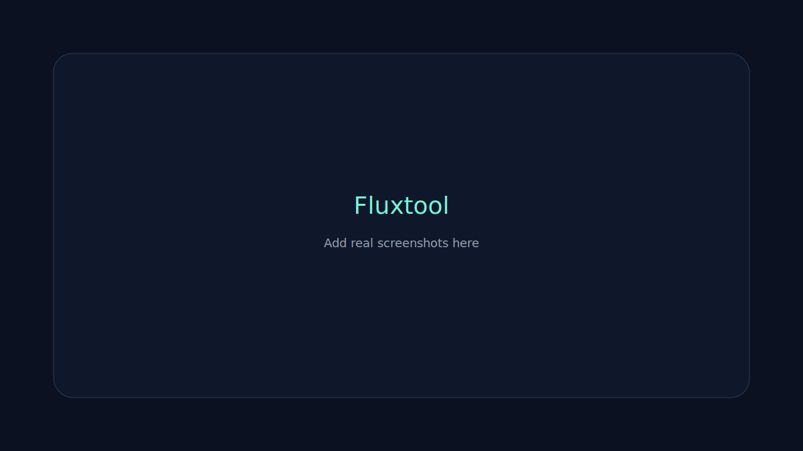

# Fluxtool

[](https://github.com/joaoswu/Flux/actions/workflows/ci.yml)
[](https://github.com/joaoswu/Flux/actions/workflows/release.yml)
[](https://github.com/joaoswu/Flux/releases)

Fluxtool is a modern Windows multitool for power users, built with Electron. It combines fast system utilities, automation, diagnostics, and productivity tools in a sleek glass UI.



## Highlights
- Live system dashboard with CPU/RAM/Disk metrics
- One-click quick actions (clear temp, flush DNS, restart Explorer, battery report)
- Disk scan with size filters + exclude patterns
- Network tools: ping, traceroute, DNS lookup
- Clipboard history with tags + auto-expire rules
- Process manager with safety prompts
- Startup manager
- Automation center with multiple schedules + run history
- Command palette (Ctrl+K)
- Tray mode + autostart toggle

## Getting Started

### Install dependencies
```powershell
npm install
```

### Run in dev mode
```powershell
npm start
```

## Build & Package

### Create distributables (installer + nupkg)
```powershell
npm run make
```

Artifacts will appear in:
```
out\make\
```

### Portable ZIP
```powershell
npm run package
powershell -NoProfile -Command "Compress-Archive -Path out\fluxtool-win32-x64\* -DestinationPath out\make\fluxtool-win32-x64.zip -Force"
```

## Publishing (Auto-Updates)
Fluxtool uses GitHub Releases for updates. Tag a release to trigger the release workflow:
```powershell
git tag v0.5.0
git push origin v0.5.0
```

Or publish manually:
```powershell
$env:GITHUB_TOKEN="YOUR_TOKEN"
npm run publish
```

## GitHub Actions
- **CI** builds on every push and uploads artifacts.
- **Release** runs on tags (`v*`) and publishes to GitHub Releases.

## Project Structure
```
assets/          App icons
src/             Main + renderer code
out/             Build output (gitignored)
docs/            Docs + screenshots
```

## Notes
- Some system actions require admin rights depending on Windows policy.
- Auto-updates require a valid GitHub release feed.

---

Built by joaoswu.
